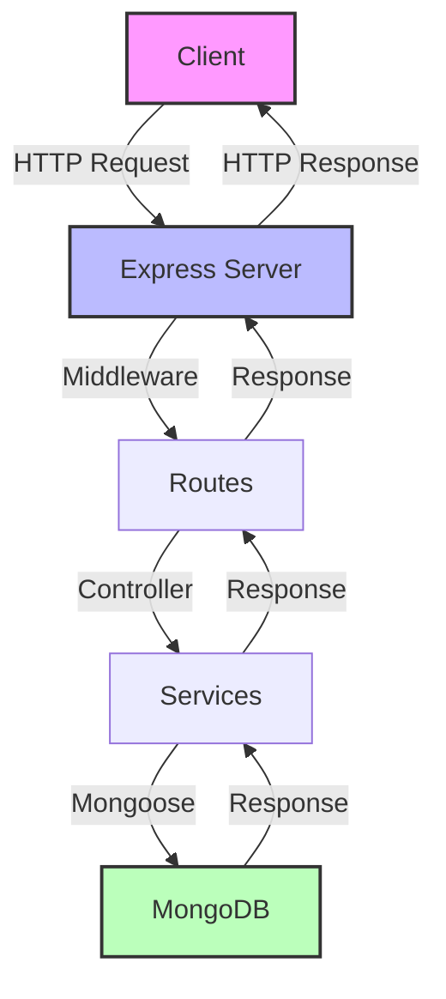

# Node MongoDB Application

## Overview
This application demonstrates a REST API implementation using Node.js and MongoDB. It provides a robust backend service with CRUD operations and data persistence.

## Features
- RESTful API endpoints
- MongoDB integration
- Express.js middleware
- Error handling
- Data validation

## Prerequisites
- Node.js v14 or higher
- MongoDB v4.4 or higher
- npm or yarn package manager

## Quick Start
```bash
# Install dependencies
npm install

# Start the server
npm start

# Run tests
npm test
```

## Architecture


## API Endpoints
| Method | Endpoint | Description |
|--------|----------|-------------|
| GET    | /api/v1  | Base endpoint |
| POST   | /api/v1/create | Create resource |
| GET    | /api/v1/:id | Get resource by ID |
| PUT    | /api/v1/:id | Update resource |
| DELETE | /api/v1/:id | Delete resource |

## Contributing
Pull requests are welcome. For major changes, please open an issue first to discuss what you would like to change.

## License
MIT

